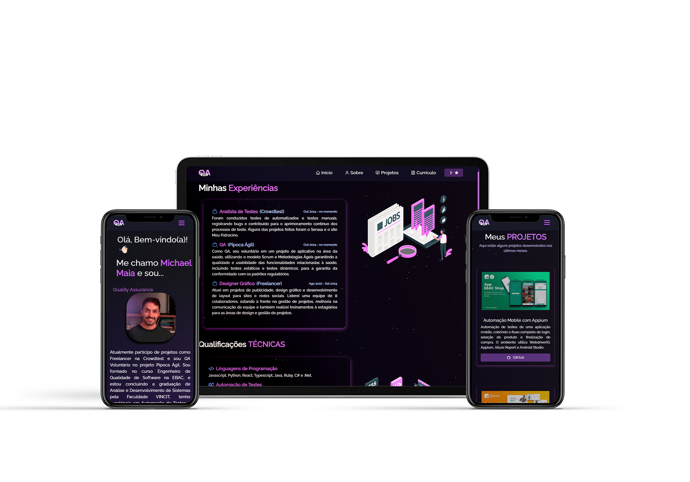

<h2 align="center">
  Portfólio de Michael Maia 
  <a href="https://qamichaelmaia.github.io/qamichael-portfolio/" target="_blank">QAfólio</a>
</h2>

  

QAFolio é um portfólio para a demonstração das minhas automações de testes.  
A ideia de criar este repositório veio do desejo de apresentar, de forma prática e objetiva, as habilidades e projetos que venho desenvolvendo na área de qualidade de software.

## Objetivo

Proporcionar aos recrutadores e interessados uma visão clara e prática do meu trabalho em automação de testes, com foco nas ferramentas que já domino, como Appium, Cypress, Selenium e Playwright, além de futuras integrações com novas tecnologias e ferramentas avançadas.  

Este portfólio reflete minha experiência e habilidade em estruturar e aplicar práticas eficientes de teste, enquanto destaca meu comprometimento em evoluir e incorporar soluções inovadoras no desenvolvimento de testes automatizados.

## Tecnologias Utilizadas

Este portfólio foi construído utilizando as seguintes tecnologias:

- React.js
- Node.js
- Express.js
- CSS3
- VsCode
- GitHub Pages

## Funcionalidades

**📖 Layout Multi-Página**  

**🎨 Estilizado com React-Bootstrap e CSS com cores fáceis de personalizar**  

**📱 Totalmente Responsivo**  

### Mostre seu apoio

Deixe uma ⭐ se você gostou deste portfólio!  
